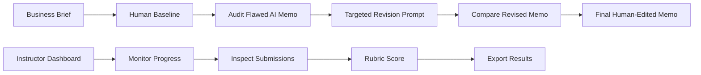
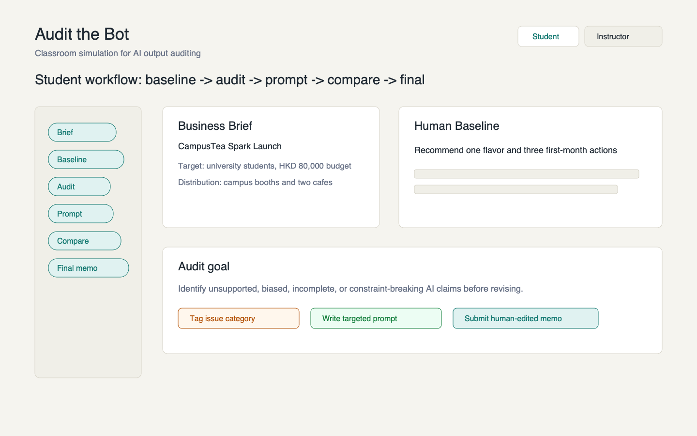
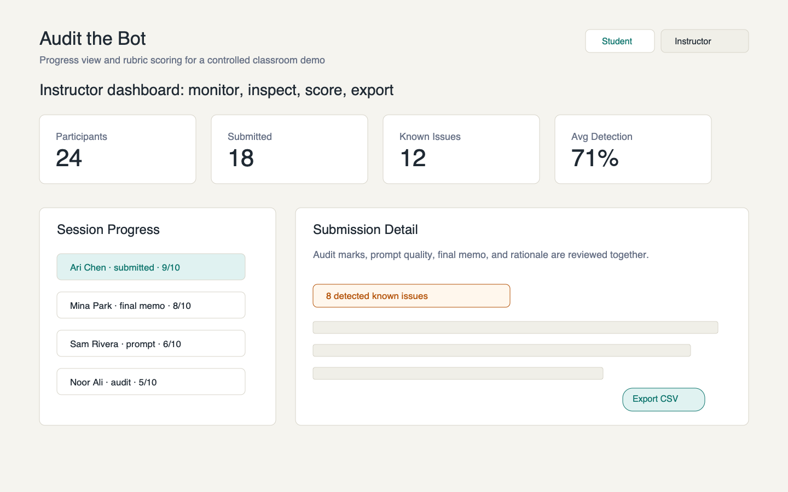
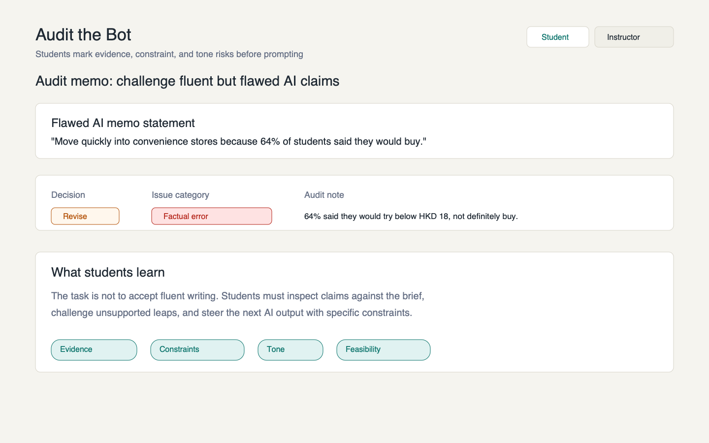
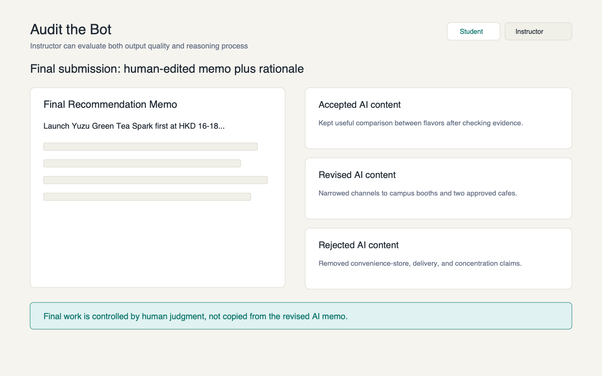

# Audit the Bot

Audit the Bot is an independent classroom simulation app for teaching students
how to audit flawed AI outputs, write targeted revision prompts, and produce
human-edited final work.

Instead of teaching students to trust AI, it teaches them to inspect, challenge,
and steer AI.

## Context for Reviewers

Audit the Bot is an independent side project built as a public, inspectable
example of my AI output-auditing and workflow-design thinking. It is not an
enterprise production system. My larger professional AI workflow work has
focused on B2B enterprise review products for large multinational retail / chain
enterprises, but that work cannot be fully disclosed or publicly demonstrated
due to confidentiality and compliance constraints.

This repository is intended to show a concrete, small-scale version of my
product approach: define a real user workflow, identify where AI output needs
human review, design structured checkpoints, and make the process understandable
to non-technical users.

## How This Relates To My Broader AI Work

My broader AI work focuses on turning AI from a chat interface into structured
business workflows. In enterprise settings, this means designing systems with
event intake, task routing, knowledge grounding, human review, approval gates,
audit trails, and clear governance boundaries.

This repository is a smaller public example of that same approach. It is
intentionally limited in scope so that reviewers can inspect the logic, run the
demo, and understand the workflow without access to private enterprise
materials.

## What it is

Audit the Bot is a Next.js classroom simulation for AI literacy and AI output
auditing. Students work through a guided business-writing task where the AI
memo is fluent, plausible, and wrong in several ways.

The app makes the learning process visible: students first write their own
baseline, then audit the AI, then prompt a revision, then decide what to keep,
change, or reject in a final human-edited memo.

## Why it exists

Many AI literacy exercises stop at "use AI to write faster." Audit the Bot
teaches a more useful habit: slow down, inspect the output, challenge the weak
parts, and steer the next iteration with evidence.

It is designed for demos, classroom pilots, recruiter review, and public GitHub
viewing.

## Why this matters

Students increasingly use AI-generated writing and recommendations. The risk is
not only wrong answers, but fluent, plausible, unsupported, biased, or incomplete
outputs.

Audit the Bot teaches AI literacy as a repeatable workflow:

```txt
baseline -> audit -> prompt -> compare -> final human edit -> rationale
```

The instructor can evaluate both the final output and the student's reasoning
process.

## Who it is for

- Students learning to evaluate AI-generated analysis and writing.
- Instructors teaching AI literacy, business communication, data-informed
  decision-making, or human-AI collaboration.
- Reviewers looking for a concise, deployable product demo with a clear
  educational use case.

## Student workflow

1. Read a business brief.
2. Write a human-only baseline recommendation.
3. Audit a flawed AI memo by tagging issues and explaining why.
4. Write a targeted revision prompt.
5. Compare the revised AI memo with the original.
6. Submit a final human-edited memo and rationale.



## Instructor workflow

- Monitor student progress.
- Inspect baselines, audit marks, prompts, final memos, and rationales.
- Assign rubric scores.
- Export JSON, analytics CSV, and BTBworkflow-compatible templates.

## Product screenshots

These are public-safe generated placeholders that show the intended demo
experience. Replace them with live deployment screenshots before a formal
launch.









## Quick start

```bash
npm install
npm run dev
```

Open [http://localhost:3000](http://localhost:3000).

## Demo mode

The current app is demo-first:

- The revised AI memo is deterministic mock content.
- Agent endpoints return mock outputs and optional provider payload previews.
- No live LLM provider calls are made.
- No provider API keys are required.
- Browser localStorage is used as a demo/client fallback.
- A local Node demo can also write shared submissions to
  `./data/audit-the-bot-submissions.json`.

This is suitable for public demos and controlled classroom trials. It is not a
full LMS or production student records system.

## Agent API design

The project includes provider-neutral mock endpoints for future live agent
integration:

- `POST /api/agents/materials`
- `POST /api/agents/revision`

The design supports future adapters for OpenAI, Anthropic, Gemini, and custom
HTTP protocols without coupling classroom logic to a single vendor.

See [docs/agent-api-design.md](docs/agent-api-design.md).

## Current MVP boundary

- Persistence is intentionally lightweight.
- Browser localStorage is acceptable for demos and controlled pilots.
- Local Node runs can use the JSON submission store.
- Vercel demo deployments should be treated as non-durable unless a database is
  added.
- No real student data should be committed, exported publicly, or used in demo
  screenshots.
- Generated materials are drafts and require instructor approval.

## Roadmap

- Replace placeholder screenshots with real Vercel deployment screenshots.
- Add optional durable backend storage for multi-session classroom use.
- Add instructor-created lesson packs.
- Add server-side live provider execution behind safe environment-variable key
  handling.
- Add richer analytics for common missed issue categories and prompt patterns.
- Add classroom import/export templates.

## Tech stack

- Next.js
- React
- TypeScript
- Vitest
- Playwright
- lucide-react
- Browser localStorage plus optional local JSON submission storage for demos

## Testing

Recommended validation commands:

```bash
npm install
npm test
npm run build
npm run test:e2e
npm audit --omit=dev
```

There is no live provider requirement for tests or builds.

## Project Summary For Recruiters

- Independent side project demonstrating AI output auditing and prompt-steering
  workflow design.
- Built with Next.js, React, and TypeScript.
- Includes student and instructor workflows for reviewing flawed AI memos and
  final human-edited submissions.
- Provides a concrete example of human-in-the-loop AI product thinking.
- Complements my larger enterprise AI workflow experience, which cannot be
  fully publicly disclosed.

## Deploy to Vercel

1. Import the repository into Vercel.
2. Use the default Next.js settings.
3. Deploy without provider API keys for current demo mode.

Environment variables are not required for the current mock demo. Future live
provider execution should use server-side environment variables such as
`OPENAI_API_KEY`, `ANTHROPIC_API_KEY`, and `GEMINI_API_KEY`.

The current Vercel deployment boundary is demo-only storage. Browser state uses
localStorage, and serverless file storage is not durable. For real classroom
operations, move submissions to a backend database such as Postgres, Supabase,
Neon, or another institution-approved store.

## Public safety / no secrets

Before making the repository public:

- Do not commit real API keys, tokens, endpoints, deployment names, or private
  credentials.
- Do not commit private student data or real classroom submissions.
- Do not send raw provider keys from the browser.
- Keep generated materials subject to instructor approval.
- Run the checks in
  [PUBLIC_RELEASE_CHECKLIST.md](PUBLIC_RELEASE_CHECKLIST.md).

## BTBworkflow integration

Instructor mode can export:

- raw submission JSON
- `audit_the_bot_analytics.csv`
- BTBworkflow dataset schema
- BTBworkflow analysis template

See [docs/btbworkflow-integration.md](docs/btbworkflow-integration.md).
